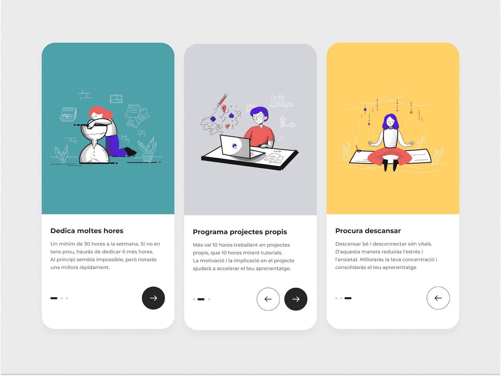

# S5. Onboarding digital (React)

## Descripción

Este proyecto es una aplicación interactiva desarrollada en React que guía al usuario a través de un tutorial paso a paso. Cada paso incluye una tarjeta con información específica, un indicador dinámico de progreso y funcionalidad para avanzar y retroceder entre pasos. Además, se han implementado animaciones y una experiencia visual adaptativa para mejorar la interacción del usuario.

<p>
  
</p>

## Tecnologías utilizadas

-React: Librería para la creación de interfaces de usuario.
-CSS3: Para estilos, maquetación y animaciones.
-Bootstrap (opcional): Para componentes interactivos como popovers.
-JavaScript (ES6): Para la lógica de componentes y navegación.

## Instalación

1. Clonar este repositorio:

   ```bash
   git clone https://github.com/Varos1009/S5.-Onboarding-digital--React-

2. Instalar las dependencias:

   ```bash
   npm install

2. Ejecutar la Aplicación:

   ```bash
   npm start